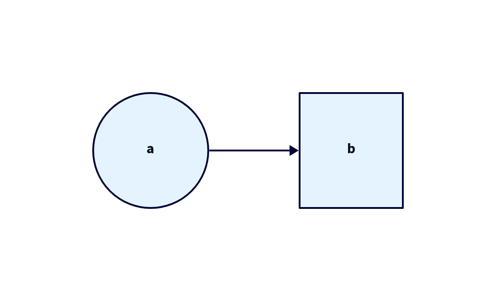
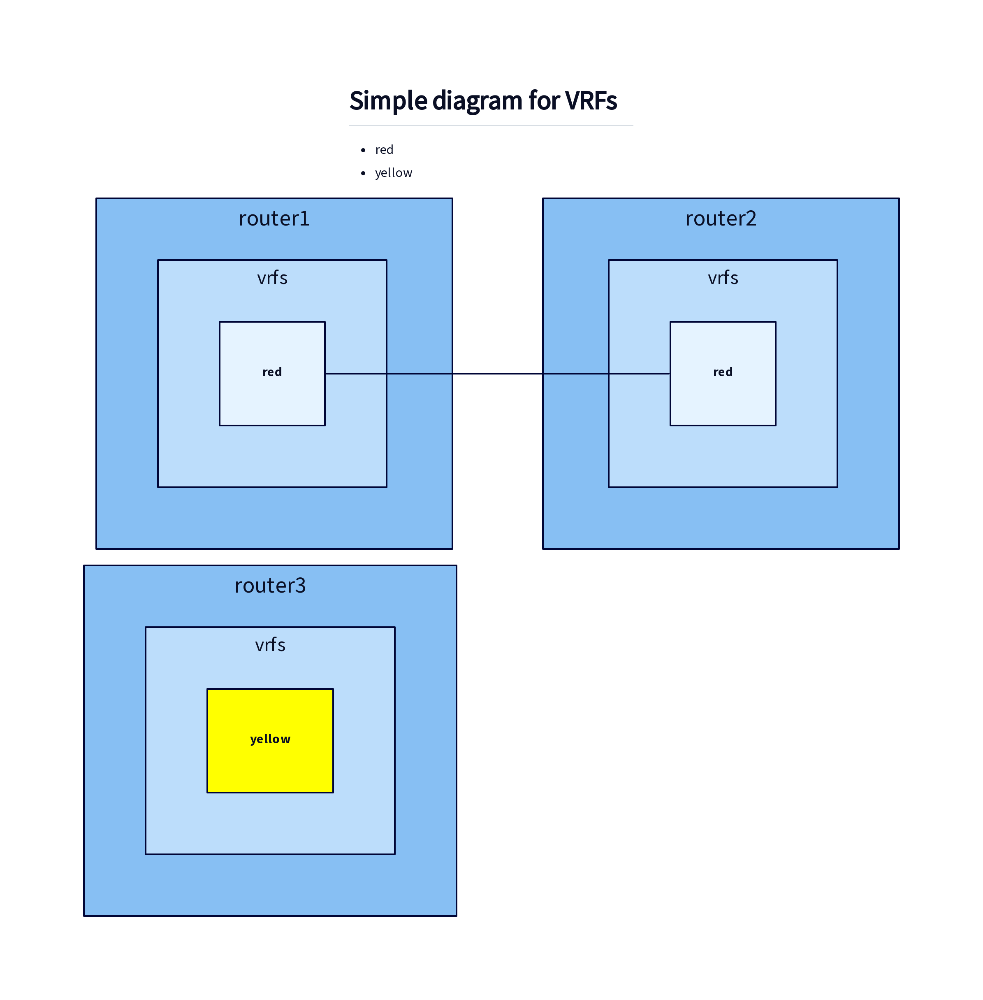
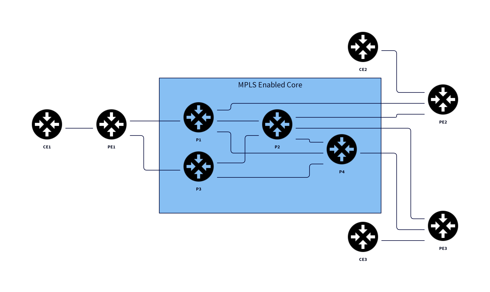

# DevOps for Docs

Some simple text written in markdown. For example, you can make a word **bold** or *italic*. Maybe you want to add a link to [arista.com](https://www.arista.com/en/). Maybe you want some inline `code`.

- some
- list
- random

1. some
2. random
3. list

```python
print("Hello, World!")
```

## Some H2 heading

These are diagrams generated with [D2](https://d2lang.com/tour/intro/).







## new stuff in version 4

## more content

## updating content for version 7 maybe
